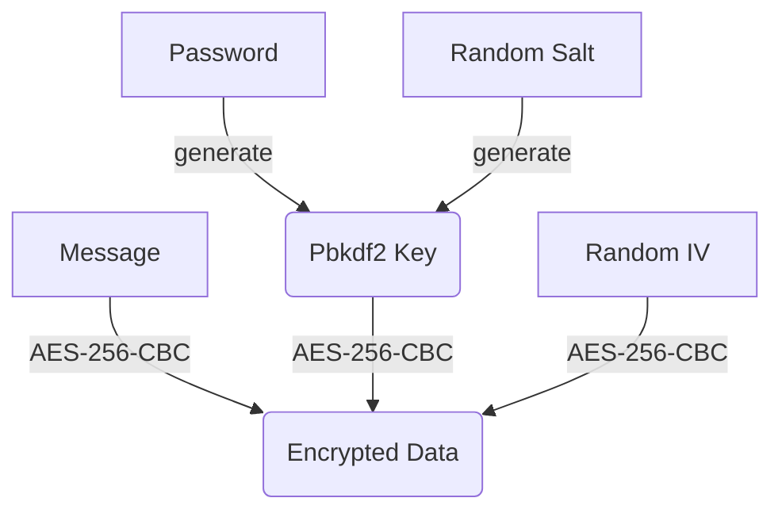

# aes-encrypt
A simple command line tool for AES encryption and decryption.

Workflow:



## Usage

To encrypt a message, type:

```
$ node aes.mjs encrypt my-secret.json
```

Enter password:

```
password: hello12345
```

Then type messages:

```
type messages (type EOF to end):
Hello, this is a secret file!
Using AES encryption!
EOF
```

When `EOF` entered the message was end, and the encrypted data saved as JSON file:

```
encrypted data saved: my-secret.json
{
  "hash-alg": "sha256",
  "message-iv-hash": "2fb92934a7b17cafef3a5e29212b0bd73ee035d80294bdaa16fdeb34742eaa46",
  "encrypt-alg": "aes-256-cbc",
  "encrypt-iv": "31d09b20a0fce0ab572653b41c7fba56",
  "encrypt-data": "48f307ba5b51fc73c4843ec6524ee07b239d9e0d7af76cfec2affaf5035a3d0534f67d7643872f143eebd2abbc9e27bb81f0383b5d1f5c132b0d8afa194c56dd",
  "pbkdf2-salt": "923a3c3f1372cf7b9cdc254473a1ee4e64b33fa07fc32130e6dbc40199b04326",
  "pbkdf2-iterations": 999999
}
```

To decrypt a message, type:

```
$ node aes.mjs decrypt my-secret.json 
```

Enter password:

```
password: hello12345
```

If password is correct, the decrypted message is display:

```
Decrypted ok:
Hello, this is a secret file!
Using AES encryption!
```

## Notes

Both the password and message are input by keyboard in terminal, and never saved into file.

The saved encrypted JSON file can be safely backed up.
