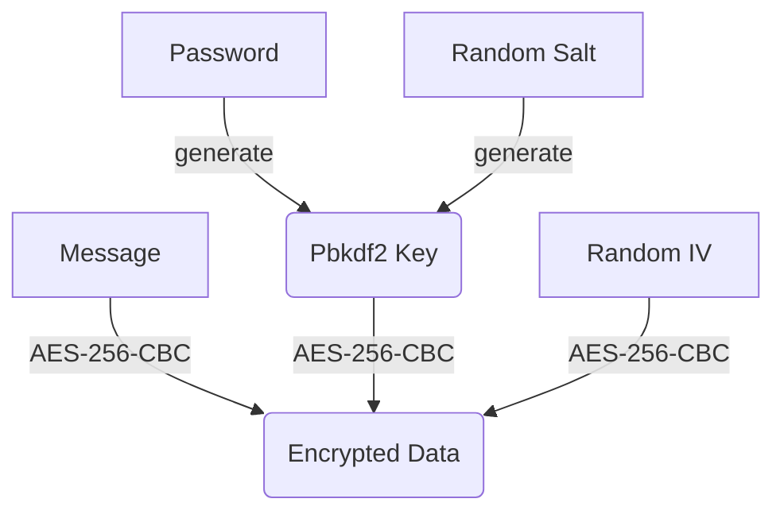

# aes-encrypt

A simple command line tool for AES encryption and decryption.

Here is the encryption process:



## Usage

To encrypt a message, type:

```
$ node aes.mjs encrypt my-secret.json
```

Enter password:

```
password: hello12345
```

Then type messages:

```
type messages (type EOF to end):
Hello, this is a secret file,
using AES encryption!
EOF
```

Enter `EOF` to indicate the end of the message, and the encrypted data will be saved as a JSON file:

```
encrypted data saved: my-secret.json
{
  "hash-alg": "sha256",
  "message-iv-hmac": "8dd75fea29068a6b5b50120d742216a6c7069272b03689955adbd2bd176265e1",
  "encrypt-alg": "aes-256-cbc",
  "encrypt-iv": "bbada646ee64dd1398384900aa6331f6",
  "encrypt-data": "888b2ca71b8dbee6c6fa3fb1c9583ba84a097d7127dd1e7b1e022c4134ddb3ab604aafdb442a3bfdaa421322d0bf770eb87d19ede00426f6f18a592248c2102d",
  "pbkdf2-salt": "e9a5c7cba3386b7f36bc876f1d48fea5740d00564bd04c42e332980dbbee86bb",
  "pbkdf2-iterations": 1352642
}
```

To decrypt a message, type:

```
$ node aes.mjs decrypt my-secret.json 
```

Enter password (don't use the weak password):

```
password: hello12345
```

If the password entered is correct, the decrypted message will be displayed:

```
Decrypted ok:
Hello, this is a secret file,
using AES encryption!
```

## Notes

- THERE IS NO WARRANTY FOR THE PROGRAM, TO THE EXTENT PERMITTED BY APPLICABLE LAW. ([GPLv3](https://github.com/michaelliao/aes-encrypt/blob/master/LICENSE))

- Don't use weak password.

- The password and the original message are entered via the keyboard and are never stored.

- Don't copy and paste message as it may be leaked by the clipboard.

- The encrypted JSON files can be securely backed up anywhere.

- Executable program is not provided to prevent malicious tampering, please install [Node.js](https://nodejs.org) and download the [source file](https://github.com/michaelliao/aes-encrypt/blob/master/aes.mjs) from GitHub and verify by yourself.

- It is recommended to run it offline and close the console window when the program end.

## File Format

The encrypted data are saved as JSON file with the following fields:

- hash-alg: hashing algorithm: "sha256";
- message-iv-hmac: hash value with hmac-sha256(key: iv, data: message);
- encrypt-alg: encrypt algorithm: "aes-256-cbc";
- encrypt-iv: the generated random IV (16 bytes);
- encrypt-data: the encrypted data;
- pbkdf2-salt: the generated random salt (32 bytes);
- pbkdf2-iterations: the random iterations which is between 1000000 ~ 2000000.
